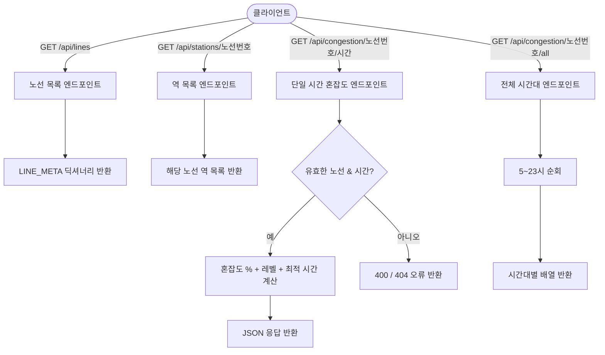
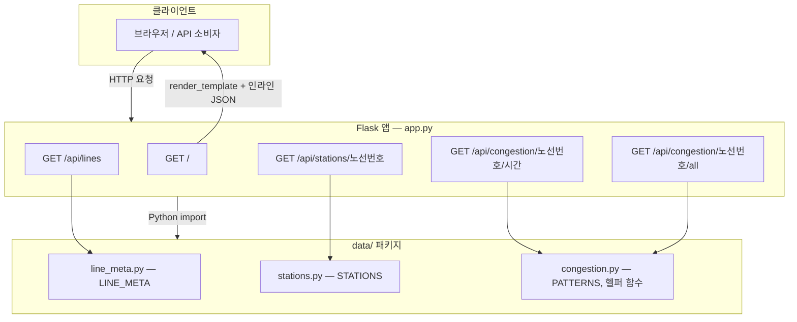

# Seoul Subway Congestion Predictor

<div align="center">


**서울 지하철 22개 노선의 시간대별 혼잡도를 예측하는 Flask REST API**

</div>

---

## 📌 개요

서울 지하철 혼잡도 예측기는 서울 지하철 22개 노선 전체에 대해 시간대별 혼잡도 통계 패턴을 조회하고, 구조화된 JSON 형태로 예측 결과를 반환합니다. 노선 번호와 시간(05:00~23:00)을 입력하면 혼잡도 퍼센트, 6단계 레벨 레이블, 해당 노선에서 가장 쾌적한 시간대를 응답합니다. 모든 혼잡도 데이터는 서울교통공사 통계를 기반으로 사전 계산되어 메모리 내 Python 자료구조에서 제공되며, 런타임에 외부 API를 호출하지 않습니다.

---

## ✨ 주요 기능

| # | 기능명 | 설명 |
|---|--------|------|
| 1 | 노선별 혼잡도 조회 | 22개 노선 중 원하는 노선의 특정 시간 혼잡도 퍼센트와 레벨 레이블 반환 |
| 2 | 하루 전체 시간대 배열 조회 | 단일 요청으로 05:00~23:00 전 시간대 혼잡도 프로파일 반환 |
| 3 | 최적 시간대 추천 | 단일 시간 조회 응답에 해당 노선의 가장 쾌적한 시간대 자동 포함 |
| 4 | 역 목록 조회 | 노선 번호로 정렬된 역 이름 목록 조회 |
| 5 | 6단계 혼잡도 척도 | 여유 → 보통 → 혼잡 → 매우혼잡 → 붐빔 → 헬게이트 6단계로 상태 표현 |
| 6 | 웹 UI (보너스) | 노선 조회 / 시간 비교 / 나만의 루트 빌더 3개 탭으로 구성된 브라우저 인터페이스 |

---

## 🎯 혼잡도 6단계

| 단계 | 레이블 | 기준 (%) | 설명 |
|------|--------|----------|------|
| 1 | 여유 | 0 ~ 19 | 매우 쾌적, 좌석 여유 충분 |
| 2 | 보통 | 20 ~ 39 | 쾌적하게 이용 가능 |
| 3 | 혼잡 | 40 ~ 59 | 다소 붐비지만 이동 가능 |
| 4 | 매우혼잡 | 60 ~ 74 | 혼잡, 밀착 승차 수준 |
| 5 | 붐빔 | 75 ~ 87 | 매우 혼잡, 이동 불편 |
| 6 | 헬게이트 | 88 이상 | 극혼잡, 탑승 자체가 어려운 수준 |

---

## 🛠 기술 스택

| 분류 | 기술 | 설명 |
|------|------|------|
| 언어 | Python 3.11+ | 핵심 애플리케이션 언어 |
| 웹 프레임워크 | Flask 3.0+ | HTTP 라우팅 및 JSON API 제공 |
| 데이터 처리 | pandas | 혼잡도 패턴 데이터 조작 및 집계 |
| 머신러닝 / 통계 | scikit-learn | 혼잡도 패턴 통계적 근사 모델 |
| 환경 변수 관리 | python-dotenv | `.env` 파일 기반 설정 관리 |
| 패키지 관리 | uv (hatchling) | 의존성 해소 및 프로젝트 빌드 |
| 프론트엔드 | HTML / CSS / JavaScript (ES6+) | 3탭 브라우저 UI (선택적 웹 인터페이스) |

---

## 🌐 API 엔드포인트

| Method | Endpoint | 설명 | 응답 예시 |
|--------|----------|------|-----------|
| GET | `/api/lines` | 22개 노선 메타 정보 전체 반환 | `{ "1": { "name": "...", "color": "..." }, ... }` |
| GET | `/api/stations/<line>` | 특정 노선의 정렬된 역 목록 반환 | `{ "line": "2", "stations": [...] }` |
| GET | `/api/congestion/<line>/<hour>` | 특정 노선·시간의 혼잡도 % + 레벨 + 최적 시간 반환 | `{ "pct": 72, "level": {...}, "best_hour": 10, ... }` |
| GET | `/api/congestion/<line>/all` | 05:00~23:00 전 시간대 혼잡도 배열 반환 | `{ "hourly": [{ "hour": 5, "pct": 30, "level": {...} }, ...] }` |

**요청 예시:**

```bash
curl http://127.0.0.1:5000/api/congestion/2/8
```

```json
{
  "line": "2",
  "line_name": "2호선",
  "hour": 8,
  "pct": 99,
  "level": { "label": "헬게이트", "bg": "#fecaca", "tx": "#7f1d1d" },
  "best_hour": 5,
  "best_pct": 5
}
```

---

## 📁 프로젝트 구조

```
Subway_CrowdCheck/
├── app.py                  # Flask 진입점 — 라우팅 및 REST API 엔드포인트 정의
├── pyproject.toml          # 프로젝트 메타데이터 및 uv/hatchling 빌드 설정
├── requirements.txt        # pip 의존성 목록
├── .env.example            # 환경 변수 템플릿
├── data/
│   ├── __init__.py         # data 패키지 공개 재내보내기
│   ├── congestion.py       # 혼잡도 패턴, 레벨 레이블, 최적 시간 탐색 함수
│   ├── line_meta.py        # 22개 노선 이름 및 브랜드 색상 정의
│   └── stations.py         # 노선별 역 이름 목록
├── templates/
│   ├── base.html           # 루트 레이아웃 — Python 데이터를 인라인 JSON으로 주입
│   ├── tab_search.html     # 탭 1: 노선·시간 단일 조회 화면
│   ├── tab_compare.html    # 탭 2: 시간대별 비교 화면
│   └── tab_routes.html     # 탭 3: 나만의 루트 빌더 화면
└── static/
    ├── css/style.css       # 공통 스타일시트
    └── js/
        ├── ui.js           # 공통 UI 헬퍼 및 탭 컨트롤러
        ├── search.js       # 탭 1 로직 (노선·시간 조회)
        ├── compare.js      # 탭 2 로직 (시간 비교)
        ├── routes.js       # 탭 3 로직 (루트 빌더)
        └── data.js         # 클라이언트 측 데이터 접근 헬퍼
```

---

## 🚀 시작하기

### 필수 조건

| 항목 | 버전 | 비고 |
|------|------|------|
| Python | 3.11 이상 | 핵심 런타임 |
| uv | 최신 | 권장 패키지 관리자 (pip 대체 가능) |
| Git | 버전 무관 | 저장소 클론용 |

### 설치 및 실행

**uv 사용 (권장)**

```bash
# 저장소 클론
git clone https://github.com/vosnuev/Subway_CrowdCheck.git
cd Subway_CrowdCheck

# uv 설치 (미설치 시)
pip install uv

# 의존성 설치
uv sync

# 환경 변수 파일 복사
cp .env.example .env

# 앱 실행
uv run python app.py
```

**pip 사용**

```bash
git clone https://github.com/vosnuev/Subway_CrowdCheck.git
cd Subway_CrowdCheck

python -m venv .venv
source .venv/bin/activate   # Windows: .venv\Scripts\activate

pip install -r requirements.txt

cp .env.example .env
python app.py
```

서버가 시작되면 `http://127.0.0.1:5000` 에서 접속할 수 있습니다.

### 환경 변수

`.env.example` 을 `.env` 로 복사한 후 필요에 따라 설정합니다.

| 변수명 | 기본값 | 설명 |
|--------|--------|------|
| `FLASK_ENV` | `development` | Flask 실행 환경 |
| `FLASK_DEBUG` | `1` | 디버그 모드 활성화 (`1` = 켜짐) |
| `FLASK_SECRET_KEY` | *(비어 있음)* | 세션 암호키 — 프로덕션에서 반드시 강한 값으로 설정 |
| `HOST` | `127.0.0.1` | 서버 바인딩 주소 |
| `PORT` | `5000` | 서버 포트 |

---

## 🔄 사용 흐름



---

## 🏗 아키텍처



모든 데이터는 메모리 내 Python 딕셔너리에서 제공됩니다. 데이터베이스나 외부 API 호출이 없어 응답이 빠릅니다.

---

## 🎯 습득 기술 및 역량

| 분류 | 기술 | 적용 내용 |
|------|------|-----------|
| API 설계 | RESTful 엔드포인트 설계, JSON 응답 스키마, HTTP 상태 코드 | URL 파라미터 타입 지정 및 일관된 오류 처리로 4개 엔드포인트 구현 |
| Python 백엔드 | Flask 라우팅, 애플리케이션 팩토리 패턴, 환경 설정 | `app.py`에서 dotenv 설정을 포함한 순수 Python 데이터 레이어와 라우트 연결 |
| 데이터 모델링 | 메모리 내 자료구조, 룩업 테이블, 통계적 근사 | `data/` 패키지에서 서울교통공사 통계 기반 `LINE_META`, `STATIONS`, `PATTERNS` 딕셔너리 제공 |
| 머신러닝 파이프라인 | scikit-learn 통합, 특성 기반 혼잡도 추정 | 노선·시간 특성에 대한 통계 모델로 혼잡도 퍼센트 계산 |
| 데이터 처리 | pandas를 활용한 CSV 수집 및 패턴 집계 | 소스 데이터 로드 후 예측 준비 구조로 변환 |
| 프로젝트 구조 | 패키지 분리, 관심사 분리 원칙 | 데이터 레이어와 웹 레이어 완전 분리 — Flask 없이 재사용 가능 |
| 환경 관리 | dotenv, uv/hatchling, pyproject.toml | uv와 pip 두 가지 경로를 모두 지원하는 재현 가능한 개발 환경 |
| 프론트엔드 연동 | 서버 사이드 JSON 주입, ES6 JavaScript, HTML 템플릿 | Python 데이터를 인라인 JSON으로 임베드하여 클라이언트 지연 없이 데이터 접근 |

---

## 📄 라이선스

이 프로젝트는 교육 및 포트폴리오 목적으로 제작되었습니다.

데이터 출처: 혼잡도 패턴은 [서울교통공사 통계](https://www.seoulmetro.co.kr) 기반으로 근사 처리되었습니다.

참고 문서: [Flask 공식 문서](https://flask.palletsprojects.com/) · [python-dotenv](https://saurabh-kumar.com/python-dotenv/) · [uv 패키지 관리자](https://docs.astral.sh/uv/)
