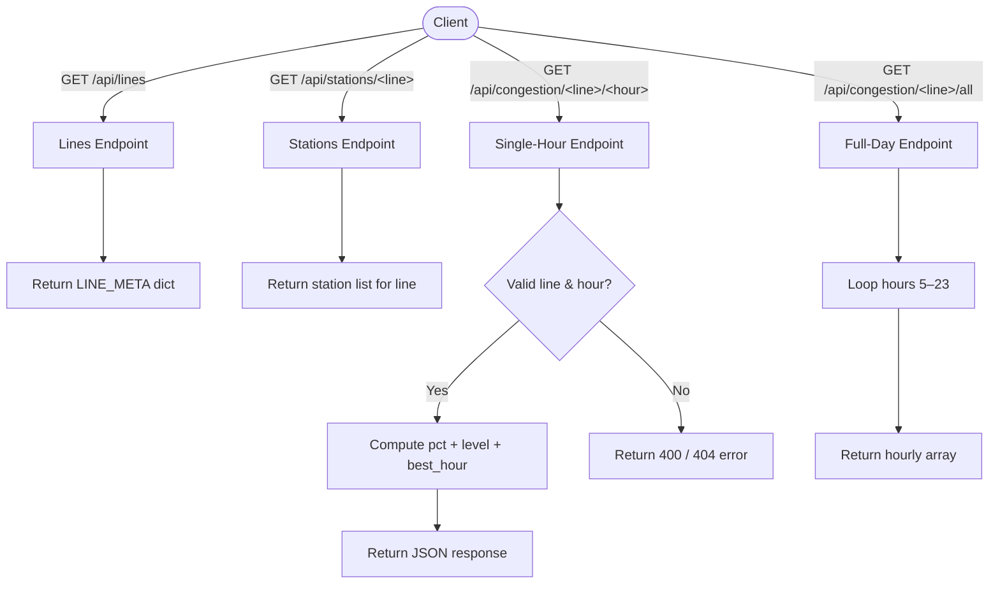
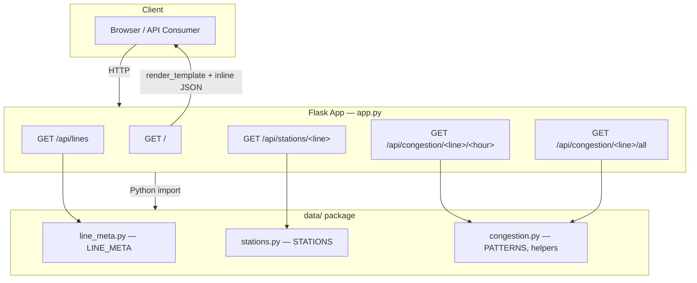

# Seoul Subway Congestion Predictor

<div align="center">


Hourly congestion prediction for all 22 Seoul subway lines, served as a Flask REST API.

</div>

---

## 📌 Overview

Seoul Subway Congestion Predictor queries statistical crowd patterns for any of Seoul's 22 subway lines and returns structured JSON predictions. Given a line number and an hour of day (05:00–23:00), the API responds with a congestion percentage, a six-tier level label, and the least-crowded hour of the day. All congestion data is pre-computed from Seoul Metro statistical approximations and served from in-memory Python structures — no external API call is made at runtime.

---

## ✨ Features

| # | Feature | Description |
|---|---------|-------------|
| 1 | Line congestion lookup | Query any of 22 Seoul subway lines at a specific hour and receive crowd percentage + level label |
| 2 | Full-day hourly array | Retrieve the complete 05:00–23:00 congestion profile for a line in a single request |
| 3 | Best-hour recommendation | Each single-hour response includes the least-crowded hour of the day for that line |
| 4 | Station list endpoint | Fetch the ordered station list for any line by line number |
| 5 | Six-tier congestion scale | Responses use a calibrated 6-level scale: Very Comfortable → Comfortable → Moderate → Crowded → Very Crowded → Extremely Crowded |
| 6 | Web UI (bonus) | Three-tab browser interface: line search, time comparison, and custom multi-station route builder |

---

## 🛠 Tech Stack

| Category | Technology | Purpose |
|----------|-----------|---------|
| Language | Python 3.11+ | Core application language |
| Web Framework | Flask 3.0+ | HTTP routing and JSON API |
| Data Processing | pandas | Crowd pattern data manipulation |
| ML / Statistics | scikit-learn | Statistical approximation of congestion patterns |
| Environment | python-dotenv | Environment variable management |
| Package Manager | uv (hatchling) | Dependency resolution and project build |
| Frontend | HTML / CSS / JavaScript (ES6+) | Three-tab browser UI (optional web interface) |

---

## 📁 Project Structure

```
Subway_CrowdCheck/
├── app.py                  # Flask entry point — routing & REST API endpoints
├── pyproject.toml          # Project metadata & uv/hatchling build config
├── requirements.txt        # Minimal pip dependency list
├── .env.example            # Environment variable template
├── data/
│   ├── __init__.py         # Public re-exports for the data package
│   ├── congestion.py       # Crowd patterns, level labels, best-hour finder
│   ├── line_meta.py        # Line names and brand colors for all 22 lines
│   └── stations.py         # Station name lists per line
├── templates/
│   ├── base.html           # Root layout — injects Python data as inline JSON
│   ├── tab_search.html     # Tab 1: single-line, single-hour lookup
│   ├── tab_compare.html    # Tab 2: multi-hour comparison view
│   └── tab_routes.html     # Tab 3: custom multi-station route builder
└── static/
    ├── css/style.css       # Shared stylesheet
    └── js/
        ├── ui.js           # Shared UI helpers & tab controller
        ├── search.js       # Tab 1 logic (line/hour search)
        ├── compare.js      # Tab 2 logic (time comparison)
        ├── routes.js       # Tab 3 logic (route builder)
        └── data.js         # Client-side data access helpers
```

---

## 🚀 Getting Started

### Prerequisites

| Requirement | Version | Notes |
|-------------|---------|-------|
| Python | 3.11+ | Core runtime |
| uv | latest | Recommended package manager (or use pip) |
| Git | any | For cloning the repository |

### Installation

**Using uv (recommended)**

```bash
# Clone the repository
git clone https://github.com/vosnuev/Subway_CrowdCheck.git
cd Subway_CrowdCheck

# Install uv if not already installed
pip install uv

# Install dependencies
uv sync

# Copy environment template
cp .env.example .env

# Run the app
uv run python app.py
```

**Using pip**

```bash
git clone https://github.com/vosnuev/Subway_CrowdCheck.git
cd Subway_CrowdCheck

python -m venv .venv
source .venv/bin/activate   # Windows: .venv\Scripts\activate

pip install -r requirements.txt

cp .env.example .env
python app.py
```

The server starts at `http://127.0.0.1:5000` by default.

### Environment Variables

Copy `.env.example` to `.env` and configure as needed:

| Variable | Default | Description |
|----------|---------|-------------|
| `FLASK_ENV` | `development` | Flask environment |
| `FLASK_DEBUG` | `1` | Enable debug mode (`1` = on) |
| `FLASK_SECRET_KEY` | *(empty)* | Session secret — set a strong value in production |
| `HOST` | `127.0.0.1` | Server bind address |
| `PORT` | `5000` | Server port |

### API Endpoints

| Method | Endpoint | Description | Response |
|--------|----------|-------------|----------|
| GET | `/api/lines` | All 22 line metadata (name, brand color) | `{ "1": { "name": "...", "color": "..." }, ... }` |
| GET | `/api/stations/<line>` | Ordered station list for a line | `{ "line": "2", "stations": [...] }` |
| GET | `/api/congestion/<line>/<hour>` | Crowd % + level + best hour for one time slot | `{ "pct": 72, "level": "Crowded", "best_hour": 10, ... }` |
| GET | `/api/congestion/<line>/all` | Full hourly array for 05:00–23:00 | `{ "hourly": [{ "hour": 5, "pct": 30, "level": "..." }, ...] }` |

**Example request:**

```bash
curl http://127.0.0.1:5000/api/congestion/2/8
```

```json
{
  "line": "2",
  "line_name": "2호선",
  "hour": 8,
  "pct": 85,
  "level": "Very Crowded",
  "best_hour": 10,
  "best_pct": 41
}
```

---

## 🔄 Usage Flow



---

## 🏗 Architecture



All data is served from in-memory Python dictionaries. No database and no external API calls are made at runtime.

---

## 🎯 Skills Demonstrated

| Category | Skills | Context |
|----------|--------|---------|
| API Design | RESTful endpoint design, JSON response schema, HTTP status codes | Four clean endpoints with typed URL parameters and consistent error handling |
| Python Backend | Flask routing, application factory pattern, environment config | `app.py` wires routes to a pure-Python data layer with dotenv configuration |
| Data Modeling | In-memory data structures, lookup tables, statistical approximation | `data/` package exposes `LINE_META`, `STATIONS`, and `PATTERNS` dictionaries derived from Seoul Metro statistics |
| ML Pipeline | scikit-learn integration, feature-based congestion estimation | Congestion percentages computed via statistical model over line/hour features |
| Data Handling | pandas for CSV ingestion and pattern aggregation | Source data loaded and transformed into prediction-ready structures |
| Project Structure | Package decomposition, separation of concerns | Data layer fully decoupled from web layer; reusable without Flask |
| Environment Management | dotenv, uv/hatchling, pyproject.toml | Reproducible dev environment with both uv and pip paths |
| Frontend Integration | Server-side JSON injection, ES6 JavaScript, HTML templates | Python data embedded as inline JSON for zero-latency client reads |

---

## 📄 License

This project is for educational and portfolio purposes.

Data source: congestion patterns approximated from [Seoul Metro statistics](https://www.seoulmetro.co.kr).

References: [Flask documentation](https://flask.palletsprojects.com/) · [python-dotenv](https://saurabh-kumar.com/python-dotenv/) · [uv package manager](https://docs.astral.sh/uv/)
